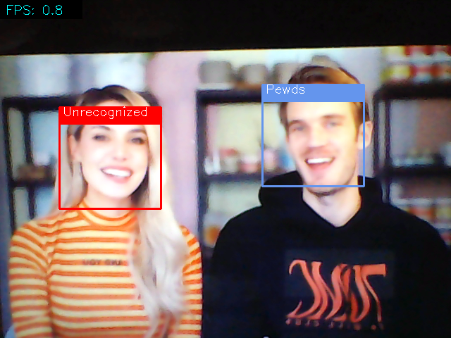
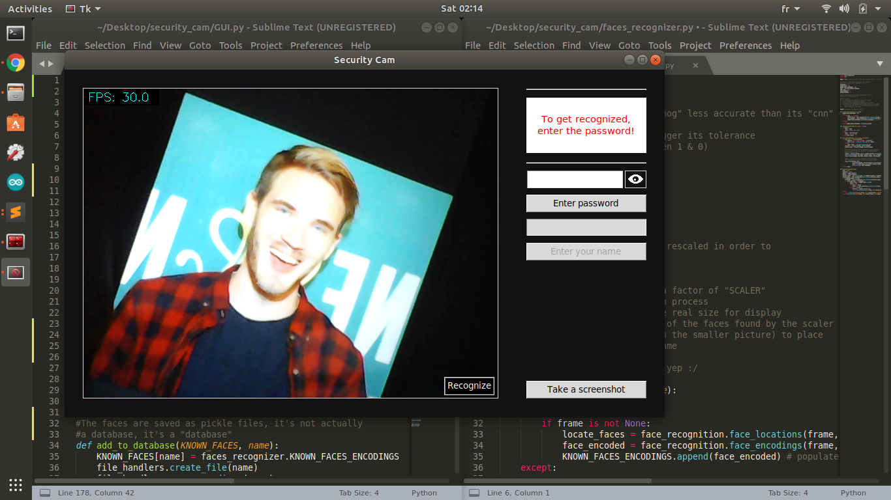

# Build an "intelligent surveillace" desktop app using Python 

>[YOUTUBE VIDEO](https://youtu.be/dMvlcd1A_kY)

---

## Description

This is a desktop app created with Python's built in library Tkinter.

It uses basic computer vision techniques to apply computer vision towards facial recognition.

### Key Words

- Python: OpenCV, face-recognition, Tkinter, OS, PIL.

- Computer Vision: facial recognition. 

---

## Disclamer

This article assumes having basic knowledge of Python, Tkinter, OpenCV, and face_recognition, since these will not be covered here.

---

## Face_recognition & OpenCV

I recommend watching this [video, https://www.youtube.com/watch?v=535acCxjHCI](https://www.youtube.com/watch?v=535acCxjHCI) to learn more about the face_recognition library.

I recommend watching this [video, https://www.youtube.com/playlist?list=PLEsfXFp6DpzRyxnU-vfs3vk-61Wpt7bOS](https://www.youtube.com/playlist?list=PLEsfXFp6DpzRyxnU-vfs3vk-61Wpt7bOS) to learn more about the OpenCV library.

---

## How to use

- Run the GUI.py file

- This interface will open:

- The stream should've already started, smile!

- You can press the "Recognize" button in the bottom right corner of the stream, and see the app not recognizing you yet.

- In order to become recognizeable, enter the password "password" (F for security) and then enter a unique name.

The password won't be visible, and instead it'll be displayed in '-' characters, in order to see what you wrote, press the "eye" icon (illuminaty confirmed ?)

- You can take screenshots too with the "Take screenshot" button.

---

## Author info

[Radhi SGHAIER, Linkedin](https://www.linkedin.com/in/radhi-sghaier/)
